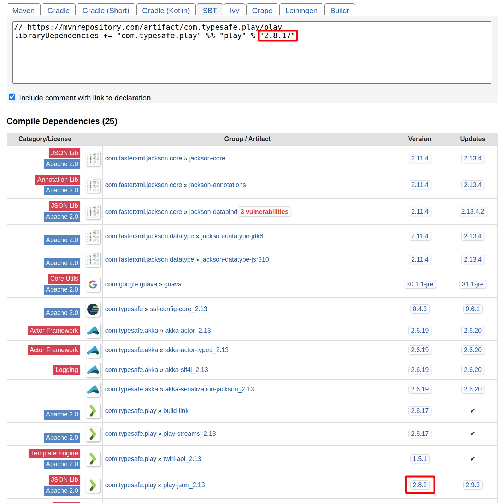

# Docker Play Seeder

Contains utilities for generating a seed image that contains appropriate dependencies needed to speed up the time
spent packing a Play! application for deployment using Docker.

When packaging a Docker image for a Play! application, most of the time is spent downloading Scala, Play!, and SBT
dependencies from the internet. Naturally, if we can preemptively download these resources, the build should be faster.

Preliminary tests have shown that preemptively downloading and caching the above resources speeds by the build time by
10 times.

### Usage

You can use this project to generate Docker images containing cached versions of `play`, `play-json`, `play-slick`,
`sbt`, `scala`, and `java` deployed to a Docker registry of your choice — you must have permissions to push to the 
specified Docker registry.

Below are the various ways of generating images:
- Using default values specified in `project/versions.scala` file
  ```shell
  sbt "dockerSeed with-defaults"
  ```

- Interactive using custom values
  ```shell
  sbt dockerSeed
  ```
  
  You will be asked for the versions to be used. Below is a sample log of events from this process
  ``` 
  $ sbt dockerSeed
  [info] Loading settings for project global-plugins from idea.sbt ...
  [info] Loading global plugins from /Users/ivan/.sbt/1.0/plugins
  [info] Loading settings for project play-docker-seeder-build from plugins.sbt ...
  [info] Loading project definition from /Users/ivan/Code/env/inventure/apps/play-docker-seeder/project
  [info] Loading settings for project root from dependencies.sbt,build.sbt ...
  [info] Set current project to play-docker-seeder (in build file:/Users/ivan/Code/env/inventure/apps/play-docker-seeder/)
  [info] ### Inquiring versions
  Play! version [2.8.17] : 2.8.17
  play-json version [2.8.2] : 2.8.2
  Scala version [2.12.18] : 2.12.18
  Java version [17.0.4-amzn] : 17.0.4-amzn
  Play-Slick version [3.0.4] :
  Sbt version [1.9.2] :
  Docker registry [ivanoronee] :
  [info] Working with versions:
  [info] - play       => 2.8.17
  [info] - play-json  => 2.8.2
  [info] - scala      => 2.12.18
  [info] - java       => 17.0.4-amzn
  [info] - play-slick => 3.0.4
  [info] - sbt        => 1.9.2
  [info] - registry   => interruptingCow
  [info] ### Updating dependencies
  [info] ### Updating plugins
  [info] ### Updating build properties
  [info] ### Building docker image
  [info] Sending build context to Docker daemon  355.3kB
  ```
  
- Non interactive using custom values
  ```shell 
  sbt "dockerSeed play-version 2.8.20 scala-version 2.12.18 java-version 17.0.4-amzn play-slick-version 3.0.4 sbt-version 1.9.2 docker-registry funkychicken" 
  ```
  
 - Non interactive with some custom values and some default values
   ```shell 
   sbt "dockerSeed with-defaults sbt-version 1.9.2 docker-registry monkeybusiness"
   ``` 
   
 When the command returns, an image will be deployed to the specified docker registry. Below is the format of the image
 ``` 
 s"$registry/play-dependencies-seed:$playVersion-sbt-$sbtVersion-scala-$scalaVersion-play-slick-$playSlickVersion-java-$javaVersion"
 ```

### Combining multiple images into a single multiarch repository
- Create images for each os/arch you wish to support with compatible machine
  (e.g. use Intel machine to create amd64 image, Apple M1 machine to create arm64 image, etc)
- Run the following command to combine the manifest
  ```shell
  docker manifest create targetName
    --amend image1
    --amend image2
  ```
  Example:
  ```shell
  docker manifest create tala/play-dependencies-seed:play-2.8.20-sbt-1.9.2-scala-2.12.18-play-slick-3.0.4-java-17.0.4-amzn-multiarch
    --amend alice/play-dependencies-seed:play-2.8.20-sbt-1.9.2-scala-2.12.18-play-slick-3.0.4-java-17.0.4-amzn-arm64
    --amend sally/play-dependencies-seed:play-2.8.20-sbt-1.9.2-scala-2.12.18-play-slick-3.0.4-java-17.0.4-amzn-amd64
  ```
- Check the combined manifest
  ``shell
  docker manifest inspect tala/play-dependencies-seed:play-2.8.20-sbt-1.9.2-scala-2.12.18-play-slick-3.0.3-java-17.0.4-amzn-multiarch
  ``
- Push the combined manifest
  ``shell
  docker manifest push tala/play-dependencies-seed:play-2.8.20-sbt-1.9.2-scala-2.12.18-play-slick-3.0.3-java-17.0.4-amzn-multiarch
  ``

### Notes
- Choosing the `play-json` version
  
  While this tool allows you to choose the `play-json` library independent of the Play! framework version,
  we strongly recommend using the same version used by the framework. You could either inspect the dependency
  using `sbt dependencyTree` or get this information from Maven Central
  ([example](https://mvnrepository.com/artifact/com.typesafe.play/play_2.13/2.8.17)). See illustration below:
  
  
- When pushing to Dockerhub, the repository that will be pushed to is `[specified registry]/play-dependencies-seed`. If
you encounter permission problems pushing ensure the following is in order:
  - If the repository `play-dependencies-seed` does not already exist in the target account, ensure that you have 
permissions to create repositories in the account 
  - If the repository `play-dependencies-seed` already exists, ensure that you have write permissions to the repository

- This is the code related to multiple architecture for if we need to do so in the future.
  ```scala
  // The easy way to build multi-platform images. Still experimental enough it doesn't seem to work for us
  val log: ProcessLogger = processLogger(state)
  val process: ProcessBuilder = stringToProcess(s"docker buildx build --platform linux/arm64/v8,linux/amd64 -t ${getDockerImageTag(state)} .")
  if (process ! log != 0) sys.error("Error building image")
  
  //This is the harder way to build multi-platform images
  val process1: ProcessBuilder = stringToProcess(s"docker build -t ${getDockerImageTag(state)}-manifest-amd64 --build-arg ARCH=amd64/ .")
  if (process1 ! log != 0) sys.error("Error building amd64 image")
  val process2: ProcessBuilder = stringToProcess(s"docker build -t ${getDockerImageTag(state)}-manifest-arm64v8 --build-arg ARCH=arm64v8/ .")
  if (process2 ! log != 0) sys.error("Error building arm64v8 image")
  
  //the code to combine cross platform images with a single manifest
  val log1: ProcessLogger = processLogger(state)
  val process1: ProcessBuilder = stringToProcess(s"docker push ${getDockerImageTag(state)}-manifest-amd64")
  if (process1 ! log1 != 0) sys.error("Error pushing amd64 docker image")
  val log2: ProcessLogger = processLogger(state)
  val process2: ProcessBuilder = stringToProcess(s"docker push ${getDockerImageTag(state)}-manifest-arm64v8")
  if (process2 ! log2 != 0) sys.error("Error pushing arm64v8 docker image")
  val log3: ProcessLogger = processLogger(state)
  val process3: ProcessBuilder = stringToProcess(s"docker manifest create ${getDockerImageTag(state)}-manifest-combined" +
    s"--amend ${getDockerImageTag(state)}-manifest-amd64 --amend ${getDockerImageTag(state)}-manifest-arm64v8")
  if (process3 ! log3 != 0) sys.error("Error creating cross platform manifest")
  val log4: ProcessLogger = processLogger(state)
  val process4: ProcessBuilder = stringToProcess(s"docker manifest push ${getDockerImageTag(state)}-manifest-combined")
  if (process4 ! log4 != 0) sys.error("Error pushing combined docker manifest")
  ```
